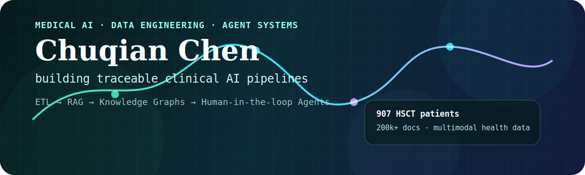
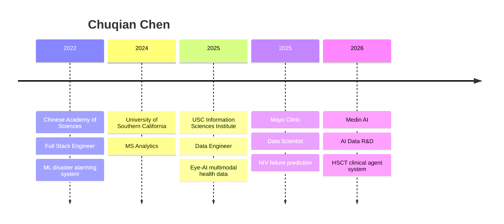

<p align="center">
  
</p>

<p align="center">
  <a href="mailto:ccq33927@gmail.com">
    
  </a>
  <a href="https://www.linkedin.com/in/chloe-chen-chuqian">
    
  </a>
  <a href="https://github.com/Chuqian-Chen">
    
  </a>
</p>

<p align="center">
  
</p>

---

## About Me

I am **Chuqian Chen**, a medical AI data engineer, machine learning engineer, and full stack developer building the bridge from raw clinical data to trustworthy model-ready systems.

Currently, I work across **multimodal healthcare ETL**, **patient-level timelines**, **LLM extraction**, **RAG**, **knowledge graphs**, **ML systems**, and **human-in-the-loop agent workflows**. My favorite systems are the ones that know when to automate, when to validate, and when to ask a human.

```txt
raw clinical data
  -> quality-controlled ETL
  -> patient timeline / feature view
  -> retrieval + model reasoning
  -> clinical review loop
  -> reusable knowledge
```

## Signal

<table>
  <tr>
    <td><b>907</b><br/>HSCT patients modeled</td>
    <td><b>200k+</b><br/>clinical documents parsed</td>
    <td><b>200k+</b><br/>OCT / fundus images processed</td>
    <td><b>92%</b><br/>healthcare data completeness</td>
  </tr>
  <tr>
    <td><b>0.81</b><br/>Mayo NIV model AUC</td>
    <td><b>71%</b><br/>early failure recall</td>
    <td><b>96.2%</b><br/>toxicity label accuracy</td>
    <td><b>83%</b><br/>medical NL-to-SQL JOIN accuracy</td>
  </tr>
</table>

## Algorithm and Builder Mode

<table>
  <tr>
    <td width="50%">
      <h3>LeetCode</h3>
      <p>
        <a href="https://leetcode.com/u/chuqianc/">Global: <b>chuqianc</b></a><br/>
        <a href="https://leetcode.cn/u/ccq33927/">China: <b>ccq33927</b></a><br/>
        400+ problems solved, regular contest participant, contest rating over 1800+, with a focus on dynamic programming and algorithms.
      </p>
    </td>
    <td width="50%">
      <h3>SDE / DS / ML Systems</h3>
      <p>
        I enjoy building end-to-end systems: data pipelines, model training, backend APIs, frontend dashboards, deployment workflows, and the glue code that makes research usable.
      </p>
    </td>
  </tr>
</table>

## What I Build

<table>
  <tr>
    <td width="50%">
      <h3>Clinical Data Infrastructure</h3>
      <p>Spark / Hive / Hadoop pipelines, DICOM parsing, PostgreSQL optimization, data quality rules, and patient-centered feature views.</p>
    </td>
    <td width="50%">
      <h3>LLM and Agent Systems</h3>
      <p>RAG, NL-to-SQL, model routing, prompt repair, multi-agent testing, and human-in-the-loop clinical review workflows.</p>
    </td>
  </tr>
  <tr>
    <td width="50%">
      <h3>Medical Knowledge Graphs</h3>
      <p>MinerU document structuring, schema-based entity-relation extraction, evidence-linked graph construction, and Neo4j pipelines.</p>
    </td>
    <td width="50%">
      <h3>Interpretable Clinical ML</h3>
      <p>XGBoost, SHAP, LoRA, RoBERTa, TensorFlow, PyTorch, imbalance handling, and clinically readable model reports.</p>
    </td>
  </tr>
  <tr>
    <td width="50%">
      <h3>Full Stack Products</h3>
      <p>Django, Spring Boot, Node.js, Flask, FastAPI, React, Vue.js, dashboards, internal platforms, and WeChat mini programs.</p>
    </td>
    <td width="50%">
      <h3>ML Systems and MLOps</h3>
      <p>Model training workflows, Kubeflow, MLflow, Docker, Kubernetes, experiment tracking, deployment, and monitoring.</p>
    </td>
  </tr>
</table>

## Featured Systems

### HSCT Self-Evolving Data Governance

Clinical data processing system for pediatric hematopoietic stem cell transplant data.

- 907 patients, 120k+ longitudinal records, 200k+ unstructured clinical documents
- raw data stays read-only; every transformation is versioned, auditable, and rerunnable
- structured patient timelines, outcome adjudication logic, prompt repair, quality review loops
- clinical note parsing with extraction-first reasoning and uncertainty-driven human review

### Eye-AI Multimodal Ophthalmology Platform

USC Information Sciences Institute healthcare data platform.

- Spark / Hive data warehouse for OCT, fundus images, DICOM metadata, and structured clinical records
- PyDICOM metadata extraction and DICOM-to-JPG conversion
- multimodal sample alignment for LLM + CV modeling
- PostgreSQL partitioning and indexing for high-throughput access

### Mayo NIV Failure Prediction

Clinical ML project for NIV failure risk.

- patient-time features for ICU respiratory trajectories
- XGBoost + SMOTE + class weighting
- AUC improved to 0.81; early failure recall improved from 42% to 71%
- SHAP reports for clinical interpretability

### Medical NL-to-SQL over MIMIC-IV

LLM evaluation and repair loop for clinical SQL generation.

- zero-shot, few-shot, and schema-constrained prompting
- DeepSeek, Qwen, Gemma, and Llama comparison
- BGE-M3 + FAISS dynamic schema retrieval
- SQL syntax check, execution validation, error parsing, and automatic rewrite

## Stack

### Core Technologies

<p>
  
  
  
  
  
  
  
  
  
  
  
  
  
  
  
  
  
  
  
  
  
  
  
  
  
  
  
  
</p>

### Languages and Tools

<p>
  
  
  
  
  
  
  
  
  
  
  
  
  
  
  
  
  
  
  
  
  
  
</p>

## Experience Snapshot



## GitHub Activity

<p align="center">
  
  
</p>

<p align="center">
  
</p>

## Certifications

- AWS Certified Cloud Practitioner
- Salesforce AI Associate Certified
- Lean Six Sigma White Belt Certification
- Career Essentials in Generative AI by Microsoft and LinkedIn
- Create ML Models with BigQuery ML Skill Badge
- Google Data Analytics
- Oracle Cloud Data Management 2023 Certified Foundations Associate

## Contact

I am open to roles and collaborations in **medical AI**, **data engineering**, **SDE / ML systems**, **LLM applications**, and **agent-system development**.

<p>
  <a href="mailto:ccq33927@gmail.com"><b>Email</b></a> ·
  <a href="https://www.linkedin.com/in/chloe-chen-chuqian"><b>LinkedIn</b></a> ·
  <a href="https://github.com/Chuqian-Chen"><b>GitHub</b></a>
</p>

<p align="center">
  <i>Interested in collaborating or have a project idea? Feel free to reach out.</i>
</p>
