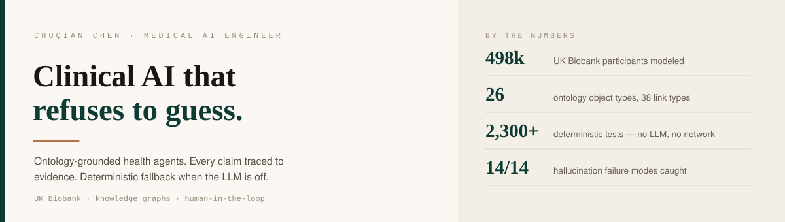
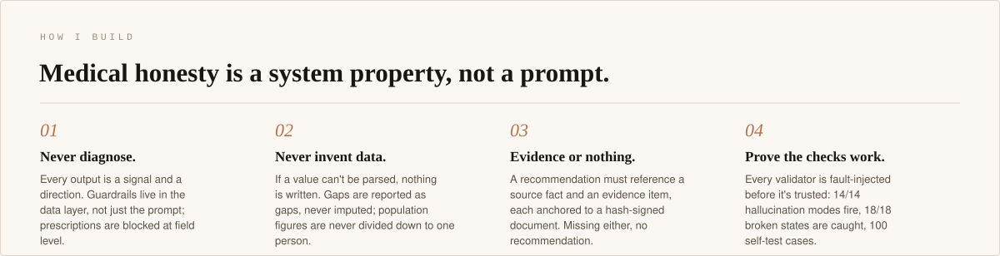
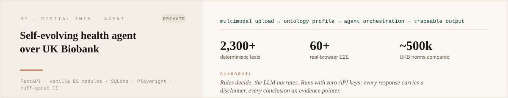
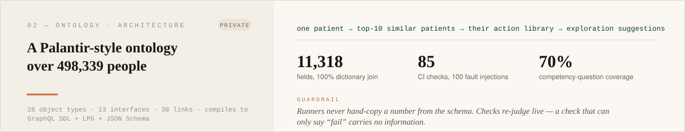
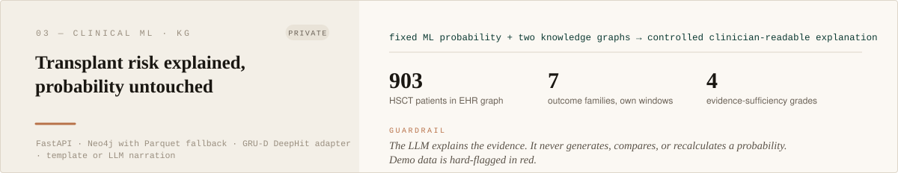
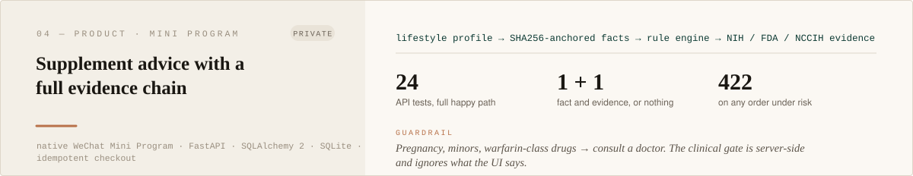

<picture>
  <source media="(prefers-color-scheme: dark)" srcset="./assets/hero-dark.svg">
  <source media="(prefers-color-scheme: light)" srcset="./assets/hero-light.svg">
  
</picture>

I work on the layer between messy clinical data and decisions people are willing to act on:
ontologies over population biobanks, knowledge-graph evidence retrieval, and health agents that fall
back to deterministic rules when the LLM is off. Most of what I ship runs with zero API keys, carries
a disclaimer on every response, and declines to answer when the evidence isn't there.

**Now** &nbsp;AI Data R&D at **Medin AI** — a self-evolving health agent and a Palantir-style ontology over
UK Biobank. On the side, 400+ LeetCode problems and a 1800+ contest rating.

 

<picture>
  <source media="(prefers-color-scheme: dark)" srcset="./assets/principles-dark.svg">
  <source media="(prefers-color-scheme: light)" srcset="./assets/principles-light.svg">
  
</picture>

## Selected systems

<picture>
  <source media="(prefers-color-scheme: dark)" srcset="./assets/card-ukb-agent-dark.svg">
  <source media="(prefers-color-scheme: light)" srcset="./assets/card-ukb-agent-light.svg">
  
</picture>

Lab reports (PDF, photo, xlsx, HEIC), wearables, CGM, blood pressure, handheld ultrasound and EEG / fMRI / fNIRS,
parsed into one ontology-backed profile and compared against ~500k UK Biobank norms. Published risk models,
12-hallmark aging, six-state drug-toxicity monitoring, and an intervention planner gated by a deterministic
safety check. With no API key configured, the rule engine answers alone. 
`FastAPI` `vanilla ES modules` `SQLite` `Playwright` `ruff → lock → pytest → E2E CI`

<picture>
  <source media="(prefers-color-scheme: dark)" srcset="./assets/card-ontology-dark.svg">
  <source media="(prefers-color-scheme: light)" srcset="./assets/card-ontology-light.svg">
  
</picture>

26 object types, 13 interfaces, 38 link types and 15 actions over 11,318 UK Biobank fields, grouped by the
official dictionary rather than by guess. Missing-aware similarity across eight data layers with 10–100%
coverage; compiles to GraphQL SDL, property-graph and JSON Schema; term reuse audited against FHIR R5 and
OMOP CDM. A self-contained HTML explorer draws all of it — and drawing it caught four schema bugs the text audits missed. 
`Parquet` `YAML schema` `Python` `85 CI checks` `100 fault-injection cases` `CQ suite 70%`

<picture>
  <source media="(prefers-color-scheme: dark)" srcset="./assets/card-hsct-dark.svg">
  <source media="(prefers-color-scheme: light)" srcset="./assets/card-hsct-light.svg">
  
</picture>

Takes an individual probability from any upstream model, retrieves evidence from a literature graph and a
903-patient EHR cohort graph for seven HSCT outcomes, and grades evidence sufficiency instead of comparing
incompatible probabilities. Per-outcome clinical windows; transplant-specific risk factors (HLA mismatch,
conditioning intensity, CMV serology, CD34 dose). Neo4j when reachable, local Parquet when not. 
`FastAPI` `Neo4j` `Parquet` `GRU-D DeepHit adapter` `controlled prompts` `demo predictions hard-flagged`

<picture>
  <source media="(prefers-color-scheme: dark)" srcset="./assets/card-women-health-dark.svg">
  <source media="(prefers-color-scheme: light)" srcset="./assets/card-women-health-light.svg">
  
</picture>

Local-first WeChat mini program plus FastAPI backend. Lifestyle answers alone drive recommendations; every
card expands to the user facts, the SHA256-signed source document, and the NIH / FDA / NCCIH evidence behind
it. Batch OCR of order screenshots; idempotent three-step checkout with a server-side clinical gate that
returns 422 under any risk context, whatever the UI does. 
`WeChat Mini Program` `FastAPI` `SQLAlchemy 2` `SQLite` `24 API tests`

<b>Also on the shelf</b>

 

**[preprocess-ui](https://github.com/Chuqian-Chen/preprocess-ui)** — local, offline-capable data-quality
workbench for messy CSV: profile fields, detect table relationships, review AI-proposed cleaning as JSON
operations before anything is applied, diff raw vs processed distributions.

**[langgraph-agent-demo](https://github.com/Chuqian-Chen/langgraph-agent-demo)** — the LangGraph overview
reduced to a runnable, unit-tested graph with a deterministic mock LLM.

<b>Earlier research</b>

 

**Eye-AI multimodal ophthalmology platform** (USC ISI) — Spark / Hive warehouse over 200k+ OCT and fundus
images, DICOM metadata and structured records; PyDICOM conversion, high-throughput PostgreSQL access,
92% data completeness after quality rules.

**NIV failure prediction** (Mayo Clinic) — patient-time ICU respiratory features, XGBoost with SMOTE and
class weighting, SHAP reports. AUC 0.81; early-failure recall lifted to 71%.

**Medical NL-to-SQL over MIMIC-IV** — DeepSeek / Qwen / Gemma / Llama comparison, BGE-M3 + FAISS schema
retrieval, SQL verification and rewrite loop. 83% JOIN accuracy.

**Clinical document extraction** — 200k+ documents parsed; 96.2% accuracy on toxicity labels.

## Stack

- **Languages** &nbsp;`Python` `Java` `TypeScript` `JavaScript` `SQL`
- **Data** &nbsp;`Spark` `Hive` `Hadoop` `Parquet` `PostgreSQL` `BigQuery` `Neo4j` `Redis` `MongoDB`
- **ML** &nbsp;`PyTorch` `TensorFlow` `XGBoost` `SHAP` `LoRA` `RoBERTa` `GRU-D`
- **LLM & agents** &nbsp;`LangGraph` `RAG` `NL-to-SQL` `FAISS` `BGE-M3` `MinerU` `constrained decoding`
- **Ontology** &nbsp;`Palantir-style object model` `FHIR R5` `OMOP CDM` `GraphQL SDL` `JSON Schema`
- **Services** &nbsp;`FastAPI` `Django` `Spring Boot` `Flask` `Node.js` `React` `Vue` `WeChat Mini Program`
- **Infra** &nbsp;`Docker` `Kubernetes` `MLflow` `Kubeflow` `Playwright` `AWS` `GCP`

## Experience

| Year | Where | Role |
| :-- | :-- | :-- |
| **2026** | Medin AI | AI Data R&D — UK Biobank health agent, medical ontology, HSCT explainability |
| **2025** | Mayo Clinic | Data Scientist — NIV failure prediction |
| **2025** | USC Information Sciences Institute | Data Engineer — Eye-AI multimodal health data |
| **2024** | University of Southern California | MS Analytics |
| **2022** | Chinese Academy of Sciences | Full Stack Engineer — ML disaster alarming system |

<b>Certifications</b>

 

AWS Certified Cloud Practitioner &nbsp;·&nbsp; Salesforce AI Associate &nbsp;·&nbsp; Google Data Analytics &nbsp;·&nbsp;
Create ML Models with BigQuery ML &nbsp;·&nbsp; Oracle Cloud Data Management 2023 Foundations Associate &nbsp;·&nbsp;
Career Essentials in Generative AI (Microsoft / LinkedIn) &nbsp;·&nbsp; Lean Six Sigma White Belt

## GitHub

  
  

## Contact

Open to work in medical AI, data engineering, ML systems, and LLM / agent development.

[Email](mailto:ccq33927@gmail.com) &nbsp;·&nbsp; [LinkedIn](https://www.linkedin.com/in/chloe-chen-chuqian) &nbsp;·&nbsp; [LeetCode](https://leetcode.com/u/chuqianc/) &nbsp;·&nbsp; [LeetCode CN](https://leetcode.cn/u/ccq33927/)
