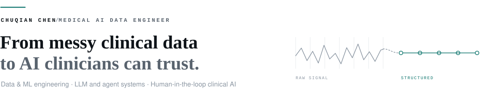
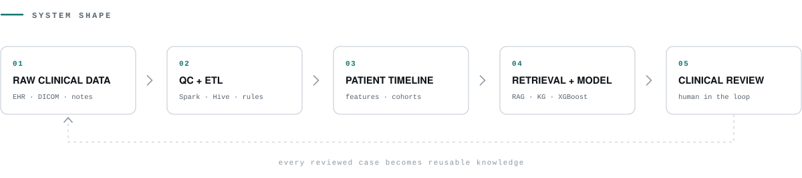

<picture>
  <source media="(prefers-color-scheme: dark)" srcset="./assets/banner-dark.svg">
  <source media="(prefers-color-scheme: light)" srcset="./assets/banner-light.svg">
  
</picture>

I build the layer between raw clinical data and models people are willing to act on —
multimodal healthcare ETL, patient-level timelines, LLM extraction, RAG, knowledge graphs,
and human-in-the-loop agent workflows. Most of what I ship starts as a research workflow
and ends as something you can run locally.

**Now** &nbsp;AI Data R&D at **Medin AI**, on an HSCT clinical agent system: knowledge-graph evidence
retrieval feeding controlled, clinician-readable explanations. On the side, 400+ LeetCode problems
and a 1800+ contest rating, mostly dynamic programming and graphs.

## What I build

<picture>
  <source media="(prefers-color-scheme: dark)" srcset="./assets/pipeline-dark.svg">
  <source media="(prefers-color-scheme: light)" srcset="./assets/pipeline-light.svg">
  
</picture>

- **Clinical data infrastructure** — Spark / Hive / Hadoop pipelines, DICOM parsing, PostgreSQL tuning, data quality rules, patient-centered feature views.
- **LLM and agent systems** — RAG, NL-to-SQL, model routing, prompt repair, multi-agent testing, human-in-the-loop review loops.
- **Medical knowledge graphs** — MinerU document structuring, schema-based entity-relation extraction, evidence-linked graphs, Neo4j pipelines.
- **Interpretable clinical ML** — XGBoost, SHAP, LoRA, RoBERTa, imbalance handling, and model reports a clinician can actually read.

## Selected work

**HSCT knowledge-graph explainability system** &nbsp;·&nbsp; *private* 
Holds the ML probability fixed, retrieves evidence from EHR and literature knowledge graphs, scores
consistency, and produces controlled clinician-readable explanations via template or LLM. 
`FastAPI` `Neo4j` `Parquet fallback` `evidence scoring` `batch + narrative inputs` 
*Guardrail: the LLM explains the evidence — it never invents or recalculates the probability.*

**[preprocess-ui](https://github.com/Chuqian-Chen/preprocess-ui)** &nbsp;·&nbsp; data quality workbench 
Local, offline-capable workbench for messy tabular data: import folders or CSV/ZIP, profile raw
fields, detect table relationships, review AI-assisted column cleaning, export clean outputs, and
compare raw vs processed distributions. 
`FastAPI` `Chart.js` `Mermaid` `local workspace storage` 
*Guardrail: raw data is never mutated — the AI proposes JSON operations a human approves first.*

**[langgraph-agent-demo](https://github.com/Chuqian-Chen/langgraph-agent-demo)** &nbsp;·&nbsp; agent loop, reduced 
The official LangGraph overview turned into a runnable graph: `START -> mock_llm -> END`, message
state flow, a reusable `build_agent_graph()`, CLI trace, and unit tests. 
`Python` `LangGraph` `MessagesState` `unittest` 
*Guardrail: a mock LLM keeps the demo deterministic and key-free.*

**[Learn_git](https://github.com/Chuqian-Chen/Learn_git)** &nbsp;·&nbsp; fundamentals 
Algorithm and Git practice, kept active alongside the larger applied systems.

<b>Earlier research systems</b>

 

**Eye-AI multimodal ophthalmology platform** — Spark / Hive warehouse over OCT, fundus images, DICOM
metadata and structured records; PyDICOM conversion and high-throughput PostgreSQL access.

**Mayo NIV failure prediction** — patient-time ICU respiratory features, XGBoost with SMOTE and class
weighting, SHAP reports. AUC 0.81, early-failure recall lifted to 71%.

**Medical NL-to-SQL over MIMIC-IV** — DeepSeek / Qwen / Gemma / Llama comparison, BGE-M3 + FAISS
schema retrieval, SQL verification, error parsing, and a rewrite loop.

## By the numbers

| Clinical modeling | Document & imaging scale | Model quality | Data quality |
| :-- | :-- | :-- | :-- |
| **900+** HSCT patients modeled | **200k+** clinical documents parsed | **0.81** AUC, Mayo NIV failure model | **92%** healthcare data completeness |
| **7** clinical outcome families mapped | **200k+** OCT / fundus images processed | **71%** early-failure recall | **96.2%** toxicity label accuracy |

## Stack

- **Languages** &nbsp;`Python` `Java` `TypeScript` `JavaScript` `SQL`
- **Data** &nbsp;`Spark` `Hive` `Hadoop` `PostgreSQL` `BigQuery` `Redis` `MongoDB` `Neo4j`
- **ML** &nbsp;`PyTorch` `TensorFlow` `XGBoost` `SHAP` `LoRA` `RoBERTa`
- **LLM** &nbsp;`LangGraph` `RAG` `NL-to-SQL` `FAISS` `BGE-M3` `MinerU`
- **Services** &nbsp;`FastAPI` `Django` `Spring Boot` `Flask` `Node.js` `React` `Vue`
- **Infra** &nbsp;`Docker` `Kubernetes` `MLflow` `Kubeflow` `AWS` `GCP`

## Experience

| Year | Where | Role |
| :-- | :-- | :-- |
| **2026** | Medin AI | AI Data R&D — HSCT clinical agent system |
| **2025** | Mayo Clinic | Data Scientist — NIV failure prediction |
| **2025** | USC Information Sciences Institute | Data Engineer — Eye-AI multimodal health data |
| **2024** | University of Southern California | MS Analytics |
| **2022** | Chinese Academy of Sciences | Full Stack Engineer — ML disaster alarming system |

<b>Certifications</b>

 

AWS Certified Cloud Practitioner &nbsp;·&nbsp; Salesforce AI Associate &nbsp;·&nbsp; Google Data Analytics &nbsp;·&nbsp;
Create ML Models with BigQuery ML &nbsp;·&nbsp; Oracle Cloud Data Management 2023 Foundations Associate &nbsp;·&nbsp;
Career Essentials in Generative AI (Microsoft / LinkedIn) &nbsp;·&nbsp; Lean Six Sigma White Belt

## GitHub

  
  

## Contact

Open to work in medical AI, data engineering, ML systems, and LLM / agent development.

[Email](mailto:ccq33927@gmail.com) &nbsp;·&nbsp; [LinkedIn](https://www.linkedin.com/in/chloe-chen-chuqian) &nbsp;·&nbsp; [LeetCode](https://leetcode.com/u/chuqianc/) &nbsp;·&nbsp; [LeetCode CN](https://leetcode.cn/u/ccq33927/)
