<picture>
  <source media="(prefers-color-scheme: dark)" srcset="./assets/hero-dark.svg">
  <source media="(prefers-color-scheme: light)" srcset="./assets/hero-light.svg">
  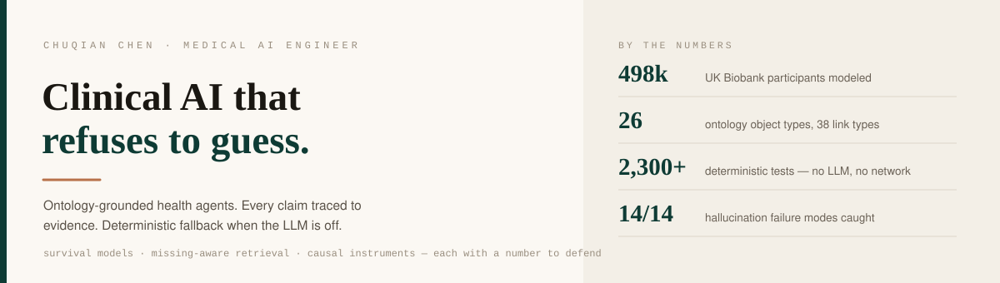
</picture>

[English](README.md) · **中文**

我做的是"杂乱临床数据"和"人愿意据此行动的决策"之间的那一层：人群生物样本库上的本体、知识图谱证据检索、
以及 LLM 关掉时能退回确定性规则的健康智能体。我交付的大多数系统不配任何 API key 也能跑，每个响应带免责声明，
证据不够就拒答。

**现在** &nbsp;在 **复旦大学** 校企产业合作公司做 AI 数据研发：UK Biobank 上的自进化健康智能体和 Palantir 风格本体。业余 LeetCode 400+ 题，竞赛分 1800+。

 

`算法` &nbsp;LeetCode 400+ 题 · 竞赛分 1800+ · 动态规划、图论、树形 DP &nbsp;·&nbsp; [global](https://leetcode.com/u/chuqianc/) / [cn](https://leetcode.cn/u/ccq33927/)

**我怎么做** &nbsp;不下诊断 · 不臆造数据 · 没证据就不输出 · 先证明检查器本身能响。

<picture>
  <source media="(prefers-color-scheme: dark)" srcset="./assets/system-map-dark.svg">
  <source media="(prefers-color-scheme: light)" srcset="./assets/system-map-light.svg">
  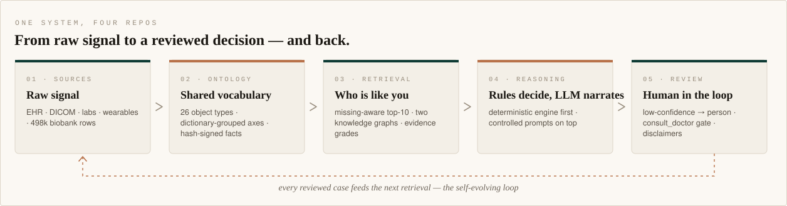
</picture>

## 机器学习

<picture>
  <source media="(prefers-color-scheme: dark)" srcset="./assets/methods-dark.svg">
  <source media="(prefers-color-scheme: light)" srcset="./assets/methods-light.svg">
  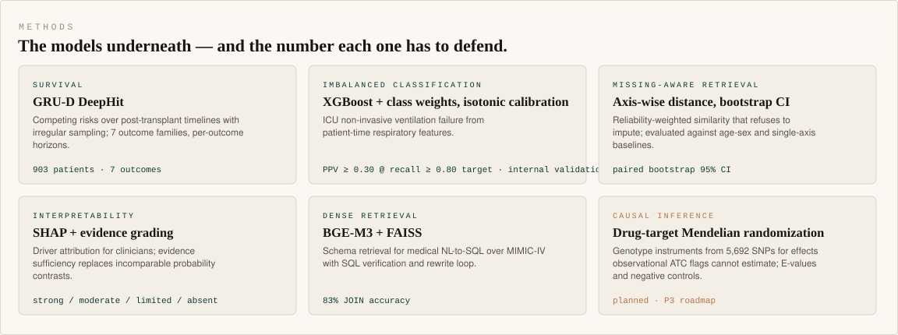
</picture>

<picture>
  <source media="(prefers-color-scheme: dark)" srcset="./assets/eval-dark.svg">
  <source media="(prefers-color-scheme: light)" srcset="./assets/eval-light.svg">
  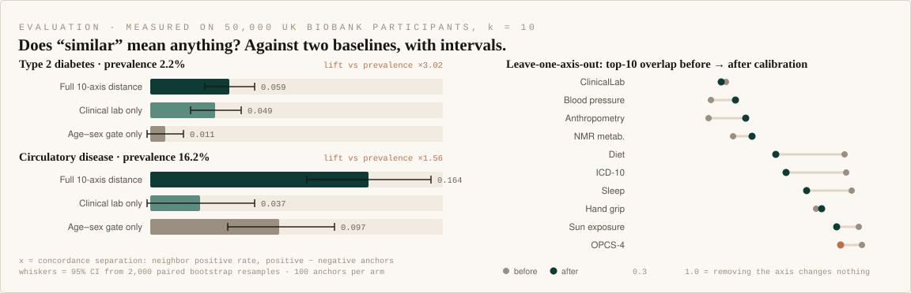
</picture>

检索效果对照年龄-性别基线和单轴基线，配对 bootstrap 区间；留一轴敏感性校准前后对比。直接读自 `retrieval_eval.json` 和 `loo_stability.json`。

<picture>
  <source media="(prefers-color-scheme: dark)" srcset="./assets/kg-dark.svg">
  <source media="(prefers-color-scheme: light)" srcset="./assets/kg-light.svg">
  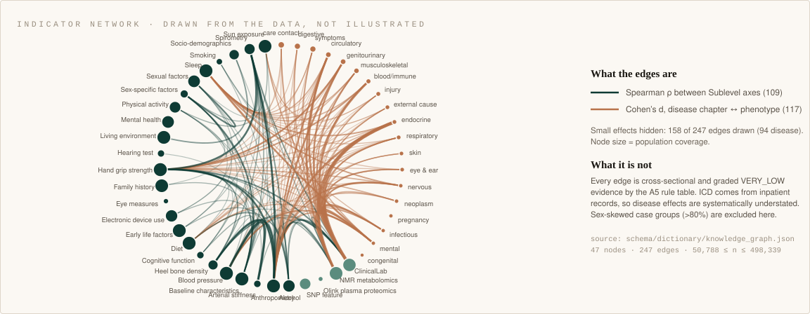
</picture>

本体自己的指标关联网络，画自 `knowledge_graph.json`：轴间 Spearman ρ，疾病章节与表型间 Cohen's d。每条边带证据等级，性别严重偏斜的病例组已剔除。

<picture>
  <source media="(prefers-color-scheme: dark)" srcset="./assets/niv-dark.svg">
  <source media="(prefers-color-scheme: light)" srcset="./assets/niv-light.svg">
  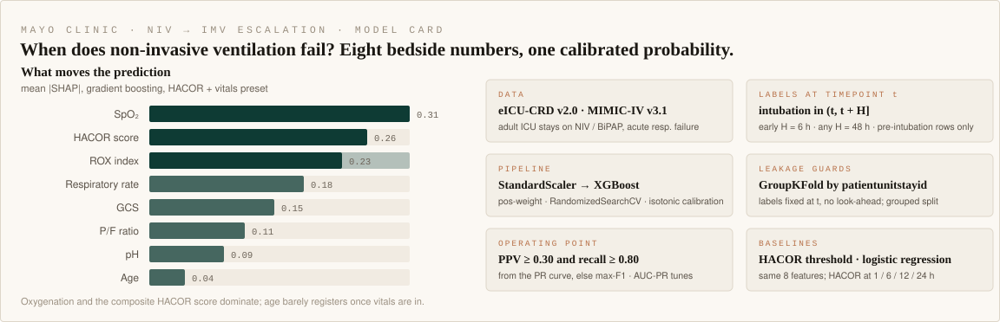
</picture>

Mayo 的 NIV 失败梯度提升模型：SHAP 重要性直接读自仓库导出的图，模型卡按实际实现写——以时间点锚定的标签、按 ICU 住院分组的交叉验证、isotonic 校准、按 PPV ≥ 0.30 且召回 ≥ 0.80 选的工作点。

## 精选系统

<picture>
  <source media="(prefers-color-scheme: dark)" srcset="./assets/card-ukb-agent-dark.svg">
  <source media="(prefers-color-scheme: light)" srcset="./assets/card-ukb-agent-light.svg">
  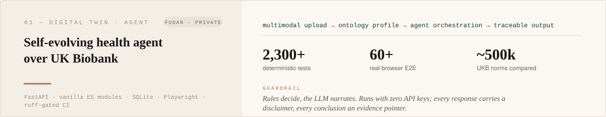
</picture>

**复旦大学** · 校企产业合作公司 · 2026 

体检报告（PDF / 拍照 / xlsx / HEIC）、可穿戴、CGM、血压计、手持超声和 EEG / fMRI / fNIRS，解析进同一个本体化画像，
与约 50 万 UKB 分层常模对照。已发表风险模型、12 hallmarks 衰老评估、用药毒性六态监测、必过确定性安全闸的干预规划。
不配 key 时规则引擎独立作答。 
`FastAPI` `vanilla ES modules` `SQLite` `Playwright` `ruff → lock → pytest → E2E CI`

<picture>
  <source media="(prefers-color-scheme: dark)" srcset="./assets/card-ontology-dark.svg">
  <source media="(prefers-color-scheme: light)" srcset="./assets/card-ontology-light.svg">
  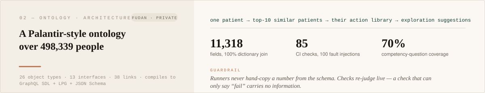
</picture>

**复旦大学** · 校企产业合作公司 · 2026 

11,318 个 UKB 字段上的 26 个 Object Type、13 个 Interface、38 条 Link、15 个 Action，按官方字典分组而不是靠猜。
八个覆盖率 10–100% 的数据层上做缺失感知相似检索；编译成 GraphQL SDL、属性图 schema 和 JSON Schema；术语复用对照 FHIR R5 / OMOP CDM。
一个自包含 HTML 把整套本体画出来——画的过程本身查出了四个纯文本审计漏掉的 schema 问题。 
`Parquet` `YAML schema` `Python` `85 CI checks` `100 fault-injection cases` `CQ suite 70%`

<picture>
  <source media="(prefers-color-scheme: dark)" srcset="./assets/ontology-tiers-dark.svg">
  <source media="(prefers-color-scheme: light)" srcset="./assets/ontology-tiers-light.svg">
  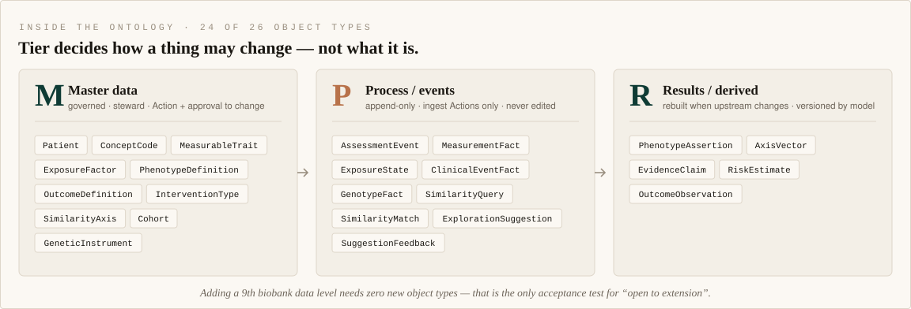
</picture>

<picture>
  <source media="(prefers-color-scheme: dark)" srcset="./assets/retrieval-dark.svg">
  <source media="(prefers-color-scheme: light)" srcset="./assets/retrieval-light.svg">
  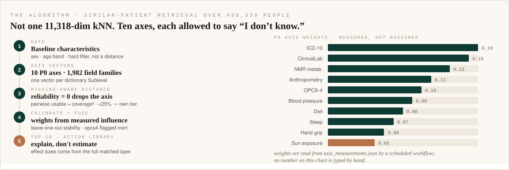
</picture>

<picture>
  <source media="(prefers-color-scheme: dark)" srcset="./assets/card-women-health-dark.svg">
  <source media="(prefers-color-scheme: light)" srcset="./assets/card-women-health-light.svg">
  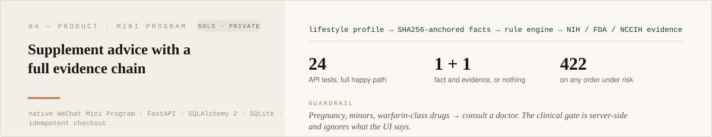
</picture>

**独立开发** · 2026 

本地优先的微信小程序 + FastAPI 后端。仅凭生活方式问答就能出推荐；每张卡展开都是用户事实、SHA256 签名的来源文档和背后的 NIH / FDA / NCCIH 证据。
外卖订单截图批量 OCR；幂等三步下单，服务端临床闸门在任何风险情境下返回 422，不管前端怎么说。 
`WeChat Mini Program` `FastAPI` `SQLAlchemy 2` `SQLite` `24 API tests`

<picture>
  <source media="(prefers-color-scheme: dark)" srcset="./assets/card-hsct-dark.svg">
  <source media="(prefers-color-scheme: light)" srcset="./assets/card-hsct-light.svg">
  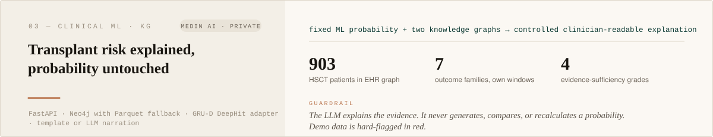
</picture>

**Medin AI** · AI 数据研发 · 2026 

接任意上游模型给出的个体化概率，从文献图谱和 903 例 EHR 队列图谱检索七类 HSCT 结局的证据，用证据充分度分级代替口径不同的概率比大小。
每类结局有自己的临床观察窗；移植学风险因子（HLA 错配、预处理强度、CMV 血清学、CD34 剂量）。Neo4j 可达走 Neo4j，否则本地 Parquet。 
`FastAPI` `Neo4j` `Parquet` `GRU-D DeepHit adapter` `controlled prompts` `demo predictions hard-flagged`

<b>其他公开仓库</b>

 

**[preprocess-ui](https://github.com/Chuqian-Chen/preprocess-ui)** — local, offline-capable data-quality
workbench for messy CSV: profile fields, detect table relationships, review AI-proposed cleaning as JSON
operations before anything is applied, diff raw vs processed distributions.

**[langgraph-agent-demo](https://github.com/Chuqian-Chen/langgraph-agent-demo)** — the LangGraph overview
reduced to a runnable, unit-tested graph with a deterministic mock LLM.

<b>早期研究</b>

 

**Eye-AI multimodal ophthalmology platform** (USC ISI) — Spark / Hive warehouse over 200k+ OCT and fundus
images, DICOM metadata and structured records; PyDICOM conversion, high-throughput PostgreSQL access,
92% data completeness after quality rules.

**NIV → IMV 升级预测**（Mayo Clinic）— eICU-CRD / MIMIC-IV 上 1 / 6 / 12 / 24 h 的 HACOR 评分加生命体征；XGBoost 类权重、按 ICU 住院 GroupKFold、isotonic 校准、SHAP；Streamlit 应用含队列筛选、表型与病例浏览。目前只有内部验证，尚无独立测试集，因此不报 AUC。

**Medical NL-to-SQL over MIMIC-IV** — DeepSeek / Qwen / Gemma / Llama comparison, BGE-M3 + FAISS schema
retrieval, SQL verification and rewrite loop. 83% JOIN accuracy.

**Clinical document extraction** — 200k+ documents parsed; 96.2% accuracy on toxicity labels.

## 技术栈

<picture>
  <source media="(prefers-color-scheme: dark)" srcset="./assets/stack-dark.svg">
  <source media="(prefers-color-scheme: light)" srcset="./assets/stack-light.svg">
  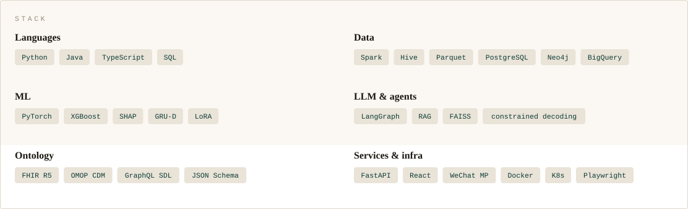
</picture>

## 经历

<picture>
  <source media="(prefers-color-scheme: dark)" srcset="./assets/timeline-dark.svg">
  <source media="(prefers-color-scheme: light)" srcset="./assets/timeline-light.svg">
  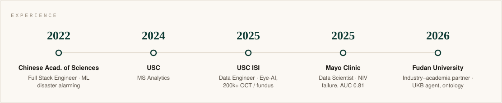
</picture>

<b>证书</b>

 

AWS Certified Cloud Practitioner &nbsp;·&nbsp; Salesforce AI Associate &nbsp;·&nbsp; Google Data Analytics &nbsp;·&nbsp;
Create ML Models with BigQuery ML &nbsp;·&nbsp; Oracle Cloud Data Management 2023 Foundations Associate &nbsp;·&nbsp;
Career Essentials in Generative AI (Microsoft / LinkedIn) &nbsp;·&nbsp; Lean Six Sigma White Belt

## 验证

<picture>
  <source media="(prefers-color-scheme: dark)" srcset="./assets/verification-dark.svg">
  <source media="(prefers-color-scheme: light)" srcset="./assets/verification-light.svg">
  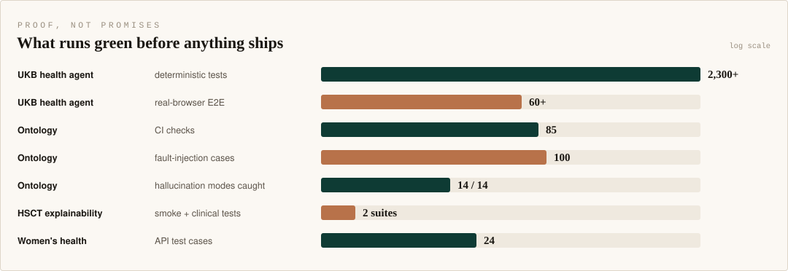
</picture>

## 联系

欢迎医学 AI、数据工程、ML 系统、LLM / 智能体方向的工作与合作。

[Email](mailto:ccq33927@gmail.com) &nbsp;·&nbsp; [LinkedIn](https://www.linkedin.com/in/chloe-chen-chuqian) &nbsp;·&nbsp; [LeetCode](https://leetcode.com/u/chuqianc/) &nbsp;·&nbsp; [LeetCode CN](https://leetcode.cn/u/ccq33927/)
